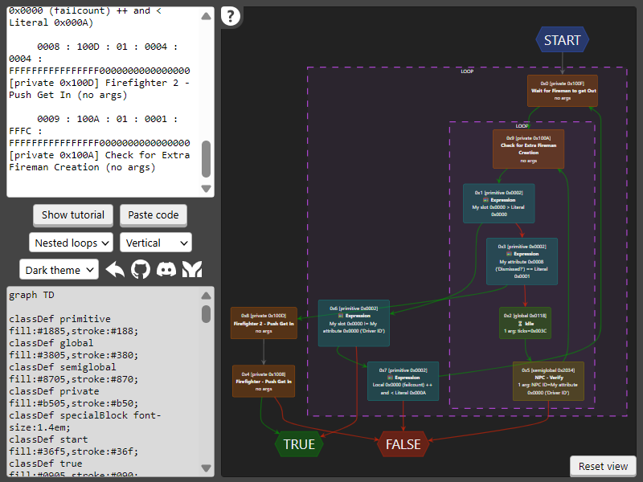
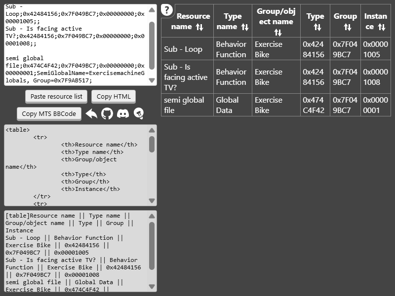

# BHAV to Mermaid diagram
https://cosmatevs.github.io/bhav-to-diagram.html

A web tool for The Sims 2 modders that converts [SimPe](https://modthesims.info/showthread.php?t=630456) [BHAV](https://modthesims.info/wiki.php?title=BHAV) code to [Mermaid](https://mermaid.live/edit) diagrams. It's intended to make BHAV functions easier to understand, especially the big ones.

Hover over interface elements (e.g. buttons, icons, text areas) to see explanations of what they do.

# Resource list to table
https://cosmatevs.github.io/resource-list-to-table.html

A web tool for The Sims 2 modders that converts [SimPe](https://modthesims.info/showthread.php?t=630456) resource lists to HTML and [Mod The Sims](https://modthesims.info/) BBCode tables. The tool includes group and type names, and allows to sort the rows of the generated code.

It's intended to make preparing technical descriptions for mods easier. [See an example of how it can be used.](https://modthesims.info/d/688444#overridden%20resources)

Hover over interface elements (e.g. buttons, icons, text areas) to see explanations of what they do.

